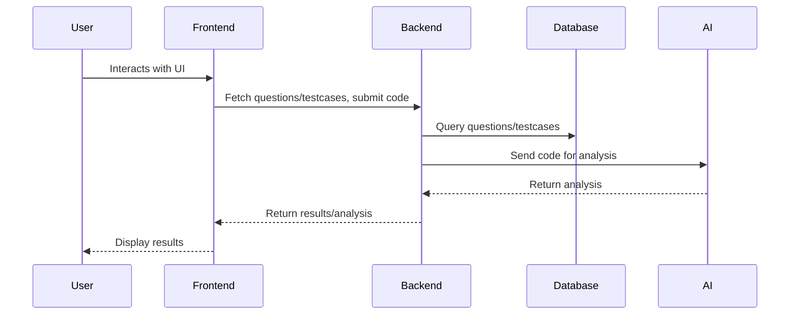

# CodePractice

A full-stack coding practice platform for solving algorithmic problems, running code, and viewing test results with AI-powered analysis.

---

## Features
- Browse coding questions by category and difficulty
- View question descriptions and sample testcases
- Write and run code in an in-browser Monaco editor
- See real-time test results (Passed/Failed)
- Analyze code complexity with AI
- Responsive, modern UI with Tailwind CSS
- Backend with Express and PostgreSQL

## Tech Stack
- **Frontend:** React, TypeScript, Tailwind CSS, Vite, Redux Toolkit, React Router, Monaco Editor
- **Backend:** Node.js, Express, PostgreSQL
- **AI Integration:** OpenRouter AI API 
- **Testing:** Jest, React Testing Library

## Architecture Diagram



---

### Coding Workspace

## Setup Instructions

### Prerequisites
- Node.js (v18+ recommended)
- npm
- PostgreSQL

### 1. Clone the repository
```sh
git clone <repo-url>
cd CodePractise
```

### 2. Backend Setup
```sh
cd backend
npm install
# Configure your .env with DB connection and OpenAI API key
npm run dev
```

### 3. Frontend Setup
```sh
cd frontend
npm install
npm run dev
```

### 4. Database Setup
- Create a PostgreSQL database and run the provided schema/migration scripts in `backend/db/`.

### 5. Running Tests
```sh
cd frontend
npm test
```

---

## Folder Structure
```
CodePractise/
├── backend/
│   ├── src/
│   ├── db/
│   └── ...
├── frontend/
│   ├── src/
│   ├── public/
│   └── ...
└── README.md
```

---

## Author
Sayana Joy
